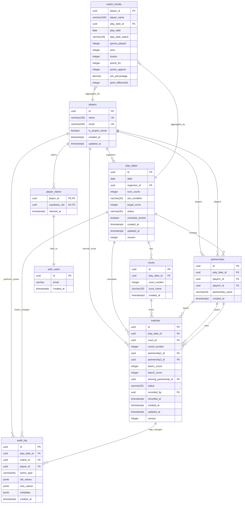

# Database Entity Relationship Diagram - Pickleball Tracker

## Overview

This Entity Relationship Diagram (ERD) represents the complete database schema for the Pickleball Tracker system. The schema supports a partnership-based round-robin tournament system with real-time updates, comprehensive audit trails, and multi-role security.

## Database Schema ERD

## Legend

### Symbols and Notations

| Symbol | Meaning |
|--------|---------|
| `PK` | Primary Key |
| `FK` | Foreign Key |
| `UK` | Unique Key |
| `||--o{` | One-to-Many relationship |
| `||--||` | One-to-One relationship |
| `}|--||` | Many-to-One relationship |

### Data Types

| Type | Description |
|------|-------------|
| `uuid` | Universally Unique Identifier |
| `varchar(n)` | Variable character string with max length n |
| `integer` | 32-bit signed integer |
| `boolean` | True/false value |
| `date` | Date value (year-month-day) |
| `timestamptz` | Timestamp with timezone |
| `jsonb` | Binary JSON data |
| `decimal` | Decimal number with precision |

### Status Values

| Field | Possible Values |
|-------|-----------------|
| `play_dates.status` | `scheduled`, `active`, `completed`, `cancelled` |
| `play_dates.win_condition` | `first_to_target`, `win_by_2` |
| `matches.status` | `waiting`, `in_progress`, `completed`, `disputed` |

## Key Relationships and Constraints

### 1. Authentication Flow
- **players** ↔ **player_claims** ↔ **auth_users**: Links player identities to Supabase authentication
- One player can claim one auth account, and vice versa
- Enables secure score entry and role-based access

### 2. Tournament Structure
- **play_dates** → **courts**: Each tournament has 1-4 courts with custom names
- **play_dates** → **partnerships**: Pre-generated doubles pairings for round-robin
- **partnerships** → **matches**: Each match involves exactly 2 partnerships

### 3. Match Scheduling
- **matches** references two partnerships (team1 and team2)
- **matches** assigned to specific court and round number
- **winning_partnership_id** denormalizes winner for performance

### 4. Audit Trail
- **audit_log** tracks all changes to matches and play dates
- JSONB fields store flexible before/after values
- Links to player who made the change

### 5. Performance Optimization
- **match_results** materialized view pre-calculates player statistics
- Strategic indexes on frequently queried columns
- Real-time subscriptions enabled for live updates

## Data Integrity Features

### Constraints
- **Check constraints**: Validate score ranges, court numbers, and status values
- **Unique constraints**: Prevent duplicate player names (FR-03), partnerships, and email addresses
- **Foreign key constraints**: Ensure referential integrity across all relationships

### Triggers
- **Schedule locking**: Prevents regeneration after first score entry
- **Audit logging**: Automatically tracks all match changes
- **Materialized view refresh**: Updates statistics after score changes

### Optimistic Locking
- **Version fields** on `play_dates` and `matches` prevent concurrent update conflicts
- Critical for real-time score entry with multiple users

## Security Architecture

### Row-Level Security (RLS)
- **Project owners**: Full access to all data
- **Organizers**: Manage their own play dates
- **Players**: Update scores for their incomplete matches only (FR-07)
- **Completed matches**: Locked from further updates (NFR-09)
- **Visitors**: Read-only access to public tournaments

### Data Privacy
- Email addresses only stored in `players` table
- No sensitive data in audit logs or exports
- Magic link authentication (no passwords stored)

## Performance Considerations

### Indexing Strategy
- **Primary lookups**: Date, organizer, status indexes on play_dates
- **Match queries**: Composite indexes on play_date_id + status
- **Partnership lookups**: Indexes on both player1_id and player2_id
- **Real-time updates**: Optimized for frequent match status changes

### Scalability
- **Maximum capacity**: 16 players, 4 courts, 120 matches per tournament
- **Concurrent users**: 50+ players per tournament
- **Storage efficiency**: ~10KB per completed tournament

This ERD provides a comprehensive view of the Pickleball Tracker database schema, supporting all functional requirements while maintaining high performance and security standards.